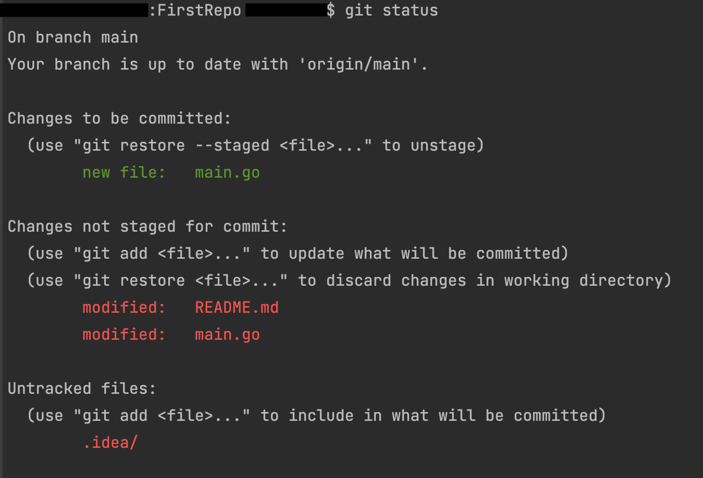

#First Repository with tasks

---
##Задание 0 ([Git](https://git-scm.com/book/ru/v2/Основы-Git-Создание-Git-репозитория))

**Изучаем и настраиваем Git:**

### *0.0* Добавляем информацию о себе
Если еще не сделала это, тогда нужно выполнить две простые команды.

Первая команда нужна для присвоения твоим commit`ам информации о тебе. 
Когда ты будешь работать совместно с кем-то, нужно будет различать кто и когда делал определенные изменения в проекте.
Будет отображаться то имя, которое ты укажешь здесь.
> git config --global user.name "Valeria Volynchikova"

Вторая же команда нужна для указания обратной связи, если у кого-то появятся вопросы по твоему проекту.
Или же люди захотят связаться с тобой для дальнейшего сотрудничества.
Обычно, здесь указывают адрес электронной почты.
> git config --global user.email your@email.com

---

### Теперь можешь открыть в GoLand свой проект FirstRepo и выполнять дальнейшие команды из терминала Goland. 

Но можешь воспользоваться и альтернативным вариантом:

Для этого нужно в консоли перейти в директорию твоего проекта FirstRepo. Затем выполнять команды, прописаные ниже.

**Советую выполнять из GoLand, т.к. там все это нагляднее**

---

### *0.1* Загрузка изменений из удаленного репозитория

Для `загрузки изменений из репозитория` тебе нужно воспользоваться командой

> git fetch

Эта команда подгружает все изменения в твой локальный репо.

---

### *0.2* Создаем ветки

**О ветвлении в Git ты можешь прочитать подробнее [здесь](https://git-scm.com/book/ru/v2/Ветвление-в-Git-О-ветвлении-в-двух-словах).**

Для выполнения каждого задания настоятельно рекомендую создавать отдельную ветку под него.

Зачем? Все просто!
Так ты сможешь сэкономить память на своем ноуте и не создавать миллион проектов под каждое из заданий, чтобы хранить их.

Также ты сможешь в любой момент очень быстро переключиться с одной ветки в другую,
чтобы посмотреть, как ты реализовала тот или иной кусочек кода. Короче говоря, вспомнить что ты делала раньше.

Для `Создания` ветки нужно выполнить команду:
> git branch имя_ветки

Для того чтобы `Переключиться на` определенную `ветку`: 
> git checkout имя_ветки

Вжух! И ты в ветке `имя_ветки` :)

---

**P.S.** Имей ввиду, что ветки завязаны друг на друге. То есть ветка не может выйти из неоткуда.
Тебе все ветки нужно создавать от главной ветки `main`.

Для этого, каждый раз, когда ты хочешь создать ветку, тебе нужно сделать 
> git checkout main
 
И только после этого создавать новую ветку.

То есть новая ветка "вытекает" из той ветки, на которой ты "стоишь"

---

Теперь, когда новая ветка создана и ты "стоишь" на этой ветке, попробуй сделать какие-нибудь изменения в файле `main.go` твоего проекта.

Например, вывести в консоль какое-то сообщение.

Сделала? Отлично!

Теперь мы можем переходить к следующему разделу.

---

### *0.x* `Git status`

Очень полезная команда, которую ты можешь выполнять когда захочешь.
> git status

В целом, эта команда отображает всю информацию о состоянии git в твоем репозитории на текущий момент.

Я выполнил эту команду во время написания этого файла:

1. В первой строке гит говорит нам, что мы сейчас работаем с веткой `main`. Мы стоим на этой ветке.
2. Вторая строка гласит, что на данный момент у нас загружены все последние изменения из ветки удаленного репозитория `origin/main`. Кстати, приписка `origin` обозначает что git говорит нам именно про ветку удаленного репозитория, а не про нашу локальную, которую ты видишь у себя в компьютере.
3. Строка `Changes to be committed:` говорит нам о тех изменениях, которые мы можем закоммитить уже сейчас. Они полностью готовы для сохранения (про коммиты читай в следующем разделе). На данный момент это файл `main.go`, т.к. я уже добавил этот файл, чтоб git считал его своим. 
4. Строка `Changes not staged for commit:` отображает, какие файлы нужно подготовить для фиксации (коммита) изменений в них.
5. Строка `Untracked files:` показывает тебе неотслеживаемые файлы. Это значит, что git видит эти файлы, но пока ему не сказали: нужно ли следить за изменениями в этом файле (его ли этот файл?), он не будет добавлять его в коммит.

---

### *0.2* Сохраняем изменения и отправляем их в удаленный репозиторий.

---

Для начала нужно `добавить новые файлы` и `посмотреть что было изменено в уже существующих` файлах. Дать понять Git`у, за какими вновь добавленными файлами ему нужно следить и какие изменения в существующих файлах учитывать.

Для этого есть два варианта: 
1. Добавить все файлы, которые находятся в твоем проекте:
> git add .

Обращаю внимание, что точка обозначает все файлы, которые лежат в текущей директории (в нашем случае FirstRepo) и пишется **раздельно** со словом `add`!

2. Добавить только некторые файлы, которые ты бы хотела видеть в своем удаленном репозитории:
> git add file_name.txt

Такую команду тебе нужно выполнить для каждого файла по отдельности, чтобы добавить несколько файлов в твой репозиторий

Замени `file_name.txt` на имя твоего файла

**В этом пункте рекомендую пользоваться первой командой `git add .` и добавлять абсолютно все файлы**

---

Хорошо, с файлами и изменениями, которые Git должен отслеживать, разобрались. 

Теперь можем сохраниться.

Для создания "контрольной точки" в этой игре по написанию своей собственной программы, для `сохранения твоих изменений` и твоего прогресса тебе нужно сделать `commit`.

> git commit -m "текст сообщения"

Эта команда `сохраняет твои изменения`, но пока только локально. 

Обычно, в тексте сообщения кратко пишут что было сделано в этом коммите.
Была ли добавлена какая-то новая функциональность в код? Или ты исправила какую-то ошибку? Можешь написать это здесь!

---

Теперь, когда точка сохранения (`commit`) создана, можно `отправить` все `изменения в удаленный репозиторий`. Для этого выполняем команду:
> git push

Все! Проверяем репозиторий на github :)

---

## Задания Golang: 

### *Задание 1* Столы
Создай ветку `task1-tables`

*Описание:*

Взяли 4 ножки и 1 столешницу. Получили 1 стол.
Дано N ножек. Напечатать, сколько из них можно сделать столов?

- В единственной строке ты должна ввести одно число - количество ножек
- В качестве `результата` работы программы, выведи одно число - количество полученных столов

*Примеры ввода и вывода:*

|     | Input: | Output: |
|-----|--------|---------|
| 1   | `12`   | `3`     |
| 2   | `11`   | `2`     |

*Не забудь запушить (отправить в удаленный репозиторий) изменения, когда выполнишь задание!*